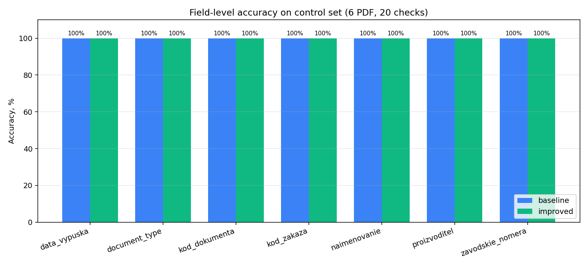
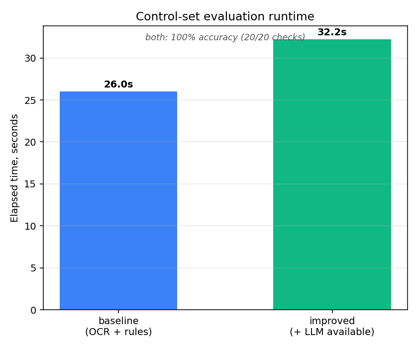

# Отчёт по итоговому проекту по курсу «Инженерия Искусственного Интеллекта»

---

## 1. Паспорт проекта

- **Название проекта:** `ПАСПОРТ.ЦИФ — извлечение данных из PDF паспортов оборудования`
- **Автор:** `Бухна Даниил Валентинович`
- **Группа:** `ИКБО-42-24`
- **Контакт:** `@Grafzilla`
- **Ссылка на репозиторий:** `https://github.com/GrafZLaa/aie_project_Bukhna`

Цель проекта — сделать сервис, который принимает PDF паспорта промышленного оборудования и автоматически достаёт из него ключевые поля (наименование, код документа, серийники, даты, производителя). На выходе — JSON по фиксированной схеме, а также выгрузка в Excel и JSON для 1С. Внутри связка OCR (Tesseract) + правила/regex + опциональный мультимодальный LLM-шаг через локальную Ollama. Проект сделан на хакатоне, потом я переоформил его под структуру курса.

---

## 2. Постановка задачи и контекст

1. **Предметная область и задача:**
Промышленный учёт оборудования. Когда на склад приходит партия, к ней идёт пачка PDF-паспортов от разных производителей — у каждого своя вёрстка, шрифт, иногда это просто скан. Оператору 1С приходится открывать каждый файл и руками переписывать поля в карточку. Долго и с ошибками. Сервис должен принимать PDF и сразу отдавать готовые поля для учётной системы.

2. **Формулировка задачи в терминах ML/ИИ:**
Это задача information extraction / Intelligent Document Processing. Вход — растровое или PDF-представление документа, выход — структурированный JSON по фиксированной схеме полей. Классическое обучение собственной модели на размеченных паспортах работает плохо: документов мало, вёрстка у каждого своя, размечать тысячу штук под обучение нерентабельно. Поэтому подход гибридный — сначала извлечение правилами, и если правила не справляются, подключается LLM как второй взгляд.

3. **Целевые метрики качества:**
В качестве основной метрики использую **field-level accuracy** на контрольной выборке. Для каждого PDF в эталоне прописаны значения нужных полей; сравниваются только те, у которых задан непустой `expected`. Сумма правильно угаданных полей делится на общее число проверок. precision/recall здесь избыточны: поле либо совпало с эталоном, либо нет — это бинарное сравнение, и доли попаданий достаточно. Дополнительно сервис сам считает `quality_score` — эвристическую оценку записи, по которой UI подсвечивает «нужна ручная проверка». Также фиксируется время прогона — оператор не должен ждать десятки секунд на документ.

---

## 3. Данные

1. **Источник данных:**
Открытые PDF-паспорта промышленного оборудования — материалы хакатона. Производители: КЭАЗ (розетка OptiDin), ТРЭИ (мастер-модуль М1201Е), ТеконГруп (групповой паспорт TCC 8L), плюс несколько служебных файлов из набора (описание задачи и экранная форма для заполнения). Все документы публичные, никаких персональных данных.

2. **Структура данных:**
В корпусе 7 PDF в папке [`приложения/`](./приложения/). Типов документов получилось четыре:
   - одиночный паспорт (с серийником и без);
   - групповой паспорт (на партию однотипных изделий);
   - перечень шкафа (cabinet list);
   - «не паспорт» — служебные файлы, для которых сервис должен корректно вернуть `document_type=unknown`.

Контрольная выборка [`samples/control_samples.json`](./samples/control_samples.json) содержит для каждого PDF ожидаемые значения 7 ключевых полей (`document_type`, `kod_dokumenta`, `naimenovanie`, `kod_zakaza`, `zavodskie_nomera`, `data_vypuska`, `proizvoditel`).

3. **Предобработка и EDA:**
EDA лежит в [`notebooks/01_eda.ipynb`](./notebooks/01_eda.ipynb). Что я там увидел:
   - корпус правда маленький и разнородный — это типичный IDP-сетап, а не задача про обучение CNN на тысячах картинок;
   - часть PDF содержит готовый текстовый слой, который PyMuPDF читает напрямую; остальное — сканы, для которых нужен OCR;
   - если встроенного текста на страницу больше 120 символов, OCR можно пропустить (порог `OCR_IF_EMBEDDED_CHARS`);
   - в эталоне не каждое поле заполнено для каждого PDF — сравниваю только то, для чего истина есть.

Перед OCR картинка проходит через `improve_image_variants` — несколько вариантов контрастности и бинаризации, по которым потом голосует Tesseract. На бледных и кривых сканах это заметно помогает.

---

## 4. Модели и подходы

1. **Базовая (baseline) модель:**
OCR (Tesseract) + правила/regex без LLM. PDF разбиваю на картинки (PyMuPDF), параллельно снимаю встроенный текст. Каждая страница идёт через Tesseract в нескольких PSM-режимах, лучший по эвристике качества (`ocr_text_quality`) побеждает. По собранному тексту работают regex-экстракторы: `_pick_document_code` для кода документа, `_extract_serials` для серийников с плаузибилити-скором, `_extract_dates`, `_extract_namenovanie`, `_extract_normative_docs`, `_extract_certificate_value`. В конце всё проходит через `final_cleanup` и `_quality_assessment`. Полностью оффлайн, без GPU, секунды на документ. Все эксперименты — в ноутбуке [`notebooks/02_baselines.ipynb`](./notebooks/02_baselines.ipynb).

2. **Улучшенная модель и эксперименты:**
Сверху накладывается LLM-шаг через Ollama, модель `llama3.2-vision`. Логика: если baseline вернул низкий `quality_score` или мало полей, и документ похож на паспорт (`_should_skip_llm_for_file` его не отсёк), то страницы кодируются в base64 и уходят в Ollama вместе с OCR-текстом. На любой проблеме с LLM (таймаут, недоступна) сервис молча откатывается на baseline. LLM добавлена не для красоты — на длинных наименованиях с переносами и нестандартных кодах заказа правила теряются, и тут LLM выручает. На простых документах её включать не нужно, поэтому стоят отсекающие эвристики.

Свою модель не обучал — корпус слишком мал. Облачные API не использую — было требование «полностью автономно», и оно сохранено.

---

## 5. Экспериментальный протокол и результаты

1. **Экспериментальный протокол:**
Прогоны через `GET /api/evaluate/default` в Docker, Ollama была поднята с моделью `llama3.2-vision:latest`. В контроле 6 PDF и 20 непустых проверок полей. Два режима: baseline (`?fast=1`, `ENABLE_LLM=0`) и improved (`?fast=0`, LLM доступна). Компаратор — `compare_eval_value`: нормализует регистр и пробелы, для списков сравнивает поэлементно. Запуски сохранены как папки в [`experiments/runs/`](./experiments/runs/): `exp_001_baseline/` и `exp_002_improved/`, в каждой `config.yaml` и `metrics.json`. Сырые JSON-ответы со всеми samples — в [`artifacts/eval_baseline.json`](./artifacts/eval_baseline.json) и [`artifacts/eval_improved.json`](./artifacts/eval_improved.json).

2. **Сравнение моделей по метрикам:**

| Модель / конфигурация | Описание                              | Поля верно / всего | Accuracy | Время  |
|-----------------------|---------------------------------------|--------------------|----------|--------|
| Baseline              | OCR + правила, LLM выключена          | 20 / 20            | 100 %    | 26.0 с |
| Improved              | + опциональный LLM-доскан (Ollama)    | 20 / 20            | 100 %    | 32.2 с |

По полям одинаково в обоих режимах: `document_type` 6/6, `kod_dokumenta` 4/4, `naimenovanie` 4/4, `proizvoditel` 3/3, `data_vypuska` 1/1, `kod_zakaza` 1/1, `zavodskie_nomera` 1/1.

Главное наблюдение: в режиме Improved LLM не вызвалась ни на одном из 6 документов. На трёх паспортах сработала эвристика «baseline уже уверен», на оставшихся трёх — «это не паспорт». Разница в 6 секунд между прогонами — это не LLM, а доскан-поиск даты выпуска по штампам (`scan_release_date=true`).

То есть фактически я замерил только baseline, а improved-режим показал, что отсекающие эвристики работают как задумано. С одной стороны это хорошо — на этих 6 документах правил хватает. С другой — выборка маленькая, и 100 % здесь не гарантия, что на широком корпусе будет так же.

3. **Выбор финальной модели:**
В прод идёт гибрид — это `_extract_document_payload` в `app/app.py`. Сначала пробую baseline (быстро и оффлайн), и если baseline недоволен своим результатом, и документ похож на паспорт, и LLM доступна — досканиваю LLM. Любая ошибка LLM → откат на baseline без падения сервиса. На моей выборке шаг с LLM не сработал ни разу, и при этом 100 % accuracy держится. Это лучше, чем «всегда LLM»: меньше латентность, меньше нагрузки на инфраструктуру, нет жёсткой завязки на доступность Ollama. На широком корпусе с шумными сканами LLM начнёт реально включаться — для этого она в архитектуре и есть.

---

## 6. Архитектура решения и сервис

1. **Архитектура пайплайна:**
Сервис — Flask на порту 5000, UI на одной HTML-странице плюс REST API. Внутри пайплайн идёт так: PDF → рендер в PNG (PyMuPDF) → multi-pass Tesseract → regex/правила и сборка чернового dict полей → проверка эвристик → если правила слабы и документ паспорт, то LLM-доскан через Ollama → финальная нормализация (`final_cleanup`) → JSON с полями и служебными `_meta`/`_evidence`/`_checklist`.

Код разнесён частично. Чистые leaf-функции — нормализация серийников, парсинг дат, eval-компаратор и константы — вынес в `src/rules/normalize.py`, `src/rules/dates.py`, `src/rules/_constants.py`, `src/eval/compare.py`. `app.py` их импортирует. Остальные слои (OCR-обвязка, LLM-этап, Flask-роуты) пока живут в `app.py` и реэкспортируются через `src/` — это удобно для ноутбуков и тестов. Полное разнесение монолита оставил как следующий шаг.

2. **API и endpoints:**
Реализованы:
   - `GET /` — UI приложения;
   - `GET /health` — health-check (`{status, service, llm_enabled}`);
   - `GET /api/meta` — диагностика конфигурации (какие модели в Ollama, какие PSM в Tesseract);
   - `POST /predict` — основной эндпойнт извлечения, alias для `/api/extract`. Принимает `multipart/form-data` с полем `file` (PDF или изображение). Возвращает JSON по схеме полей со служебным `_meta` (что использовалось — OCR/LLM) и `_evidence` (где найдено каждое значение);
   - `POST /api/preview` — превью страниц;
   - `POST /api/parse_cabinet` — разбор перечня шкафа;
   - `GET /api/evaluate/default?fast=1` — прогон на контрольной выборке;
   - `POST /api/export/excel` — выгрузка реестра в Excel;
   - `POST /api/export/1c_json` — выгрузка 1С-совместимого JSON с валидацией.

При невалидном запросе возвращается короткий `{"error": "..."}` со статусом 400 или 500.

3. **Технологический стек:**
   - Backend: Python 3.10+, Flask 3, PyMuPDF, pytesseract, Pillow, OpenCV, openpyxl.
   - OCR: Tesseract (`rus+eng`).
   - LLM: Ollama локально, модель `llama3.2-vision` (есть failover на `qwen2.5vl`, `moondream`).
   - Деплой: Docker + docker-compose из двух сервисов (`app` + `ollama`), volumes под реестр и веса модели.

Запускается командой из [`README.md`](./README.md).

---

## 7. Наблюдаемость, конфигурация и безопасность

1. **Логи и наблюдаемость:**
Стандартный `logging` в `app/app.py` — пишутся ключевые события: запуск LLM, ошибки, откаты на baseline, оценка качества. Эндпойнт `GET /health` отдаёт минимальный статус, `GET /api/meta` — диагностику конфигурации. В каждом ответе extract есть служебные `_meta` (что использовалось — OCR/LLM, где случились таймауты) и `_evidence` (для каждого поля видно, на какой странице и в каком фрагменте оно найдено). Тесты — pytest в `tests/`, гоняются в CI на GitHub Actions при каждом push в `project/**`.

2. **Конфигурации:**
   - [`.env.example`](./.env.example) — шаблон переменных окружения для конкретного развёртывания;
   - [`configs/default.yaml`](./configs/default.yaml) — декларативная карта параметров пайплайна (OCR, LLM, Flask, реестр, eval) с дефолтными значениями.

Реальные значения берутся в порядке: переменные окружения процесса → `.env` → дефолты в `app/app.py`. Перенастройка под другой стенд = правка одного `.env`, код трогать не надо.

3. **Безопасность:**
   - В репозитории нет реального `.env`, токенов или паролей — только шаблон. `.env` исключён в `.gitignore`.
   - LLM-шаг работает локально через Ollama — облачных API-ключей в проекте нет в принципе.
   - Runtime-данные сервиса (`data/registry_state.json`, `data/feedback_log.jsonl`) исключены в `.gitignore`.
   - На входах контролируется размер upload-а (`REGISTRY_B64_MAX`).

Подробно — в [`SECURITY.md`](./SECURITY.md).

---

## 8. Ограничения и дальнейшая работа

Контрольная выборка маленькая (7 файлов, 20 проверок), и 100 % здесь не доказывает, что система всегда работает идеально. Часть серверной логики ещё живёт в `app/app.py` одним файлом — вынес чистые функции, дальнейшее разнесение требует выноса глобальных конфигов в отдельный модуль с инверсией зависимостей, это полноценный рефактор. MLflow не подключал — на текущем объёме хватило JSON-файлов в `artifacts/`. Интеграция с 1С пока только в виде формата выгрузки (Excel и `/api/export/1c_json` со схемой и валидацией), реальный коннектор — отдельная задача.

В дальнейшем можно расширить корпус до сотен PDF разных производителей и честно перемерить метрики, сравнить несколько vision-LLM (`qwen2.5vl`, `moondream`, `internvl`), поднять coverage по тестам, добавить в `improve_image_variants` deskew и Sauvola-бинаризацию для шумных сканов.

---

## 9. Сценарий демонстрации на защите

- Поднимаю сервис в Docker через `scripts/start.bat`, открываю UI на `http://localhost:5000`.
- Перетаскиваю пару PDF из `приложения/` (один одиночный паспорт и один групповой), показываю извлечённые поля, `quality_score` и evidence-источники.
- Запускаю контрольный прогон через кнопку «Контроль» в UI или через `curl "http://localhost:5000/api/evaluate/default?fast=1"`, показываю accuracy.
- Открываю [`notebooks/02_baselines.ipynb`](./notebooks/02_baselines.ipynb) с таблицей сравнения baseline и improved.
- Показываю выгрузку в Excel через `/api/export/excel` и 1С-JSON через `/api/export/1c_json`.
- Обращаю внимание на запуски в [`experiments/runs/`](./experiments/runs/) и графики в [`artifacts/`](./artifacts/) (`accuracy_per_field.png`, `runtime_comparison.png`).
